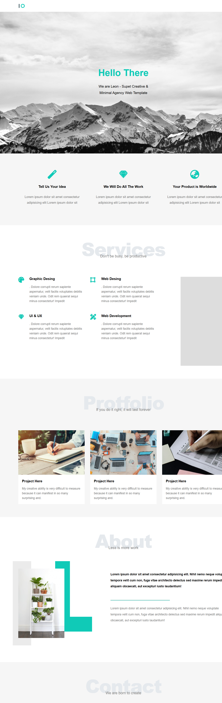
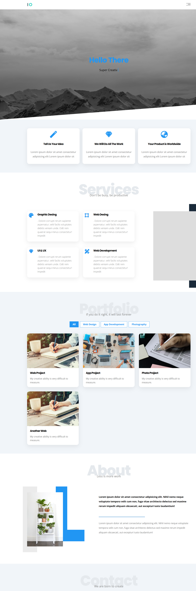

# Leon | Creative Agency Template (Modernized)


[](https://engali983.github.io/HTML_And_CSS_Template_One/)
[](https://developer.mozilla.org/en-US/docs/Web/Guide/HTML/HTML5)
[](https://developer.mozilla.org/en-US/docs/Web/JavaScript)

## 🚀 Overview

**Leon** is a responsive, single-page creative agency template. 
Originally started as a classic HTML/CSS structure (based on Elzero Web School's tutorial), this project has been **completely re-engineered** to meet modern 2025 web standards.

The goal was to transform a static layout into a dynamic, interactive user experience using Vanilla JavaScript and advanced CSS animations, focusing on UI/UX enhancements like Glassmorphism, Soft Shadows, and Micro-interactions.

---

## 🔄 The Evolution (Before vs. After)

This project represents my journey from learning the basics to mastering the details.

| Feature | Original Version (The Start) | Modernized Version (Current) |
| :--- | :--- | :--- |
| **Design Style** | Flat, Sharp Edges, Standard Layout | Soft UI, Rounded Corners, Modern Typography |
| **Interactivity** | Static Content | Typewriter Effect, Scroll Animations, Filtering |
| **User Experience** | Basic Navigation | Smooth Scroll, Sticky Header, Interactive Hovers |
| **Code Structure** | Basic HTML/CSS | Modular CSS Variables, Clean JS Architecture |

### Visual Comparison

| Before (Classic) | After (Modern Redesign) |
| :---: | :---: |
|  |  |
---

## ✨ Key Features

### 🛠 UI/UX Enhancements
* **Modern Aesthetics:** Implemented "Soft UI" design principles with rounded corners (`border-radius`), subtle shadows, and increased whitespace for better readability.
* **Typography:** Upgraded to a modern font pairing (**Outfit** for headings, **Inter** for body text) to give a premium feel.
* **Responsive Grid:** Fully responsive layout using CSS Grid and Flexbox, looking great on Mobile, Tablet, and Desktop.

### ⚡ JavaScript Implementations
* **Typewriter Effect:** A dynamic text animation in the Hero section writing: *"We are Leon, Super Creative..."*.
* **Scroll Animations:** Used **Intersection Observer API** to trigger fade-in and slide-up animations as the user scrolls.
* **Portfolio Filter:** A functional tab system to filter projects by category (Web, App, Design) using `dataset` attributes.
* **Sticky Header:** The header changes appearance (background/shadow) on scroll.
* **Smooth Navigation:** Custom smooth scrolling behavior for all internal links.

---

## 🛠️ Technologies Used

* **HTML5:** Semantic Structure.
* **CSS3:** CSS Variables (`:root`), Flexbox, Grid, Keyframes Animation, Media Queries.
* **JavaScript (ES6+):** DOM Manipulation, Event Listeners, Intersection Observer API.
* **Font Awesome:** For scalable vector icons.
* **Google Fonts:** Outfit & Inter.

---

## 🗺️ Roadmap & Future Improvements

I am constantly working to improve this template. Here is what's coming next:

- [x] **Phase 1: UI Overhaul** (Modern Colors, Rounded Corners, Shadows).
- [x] **Phase 2: JS Interactivity** (Typewriter, Scroll Reveal, Filtering).
- [ ] **Phase 3: Dark Mode** (Toggle button to switch themes).
- [ ] **Phase 4: Contact Form** (Client-side validation & Email integration).
- [ ] **Phase 5: Performance** (Lazy loading for images & Minified assets).

---

## 📂 Project Structure

```bash
├── css
│   ├── leon.css       # Main Stylesheet (Variables & Components)
│   ├── normalize.css  # CSS Reset
│   └── all.min.css    # Font Awesome
├── js
│   └── main.js        # Logic (Typewriter, Filter, Observer)
├── images             # Project Assets
├── index.html         # Main Structure
└── README.md          # Documentation
```
---

## 🤝 Acknowledgements

* **Original Layout Inspiration:** [Elzero Web School](https://elzero.org)
* **Icons:** [Font Awesome](https://fontawesome.com)
* **Fonts:** [Google Fonts](https://fonts.google.com)

---

### ❤️ Connect

If you like this project, feel free to star the repo ⭐️!

**Ali** - [GitHub Profile](https://github.com/engali983)
